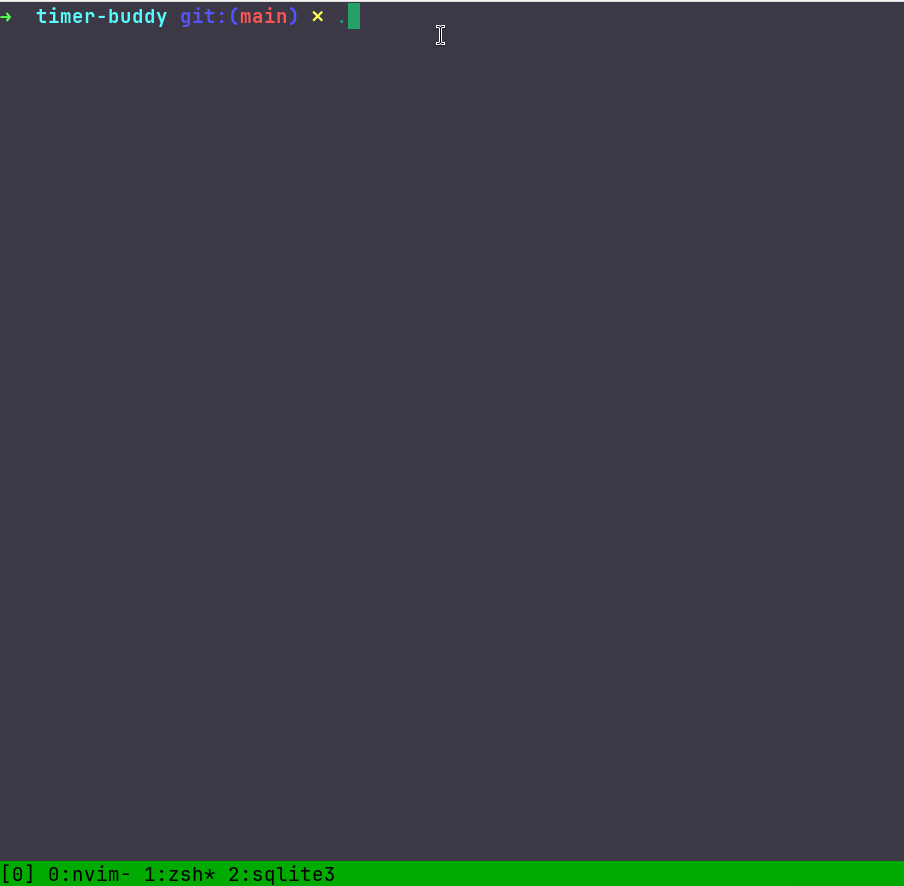

# A fun little Go project

I wanted to try and learn a bit of Go, so I created this prototype that has a stopwatch and countdown functionality with an ascii art buddy that does something. It's kinda in-progress atm and there's probably bugs here and there and in core functionality like the timers themselves. Nevertheless It was kinda fun playing around with the ANSI escapes to try to make it work.

There is better ways of counting time. I haven't really tested this with longer timeframes but I'm sure that there will be time drift. This is purely done for fun/education purposes and I wouldn't use this if time precision is in a key role. I will test this some time to see how much time drift is to be expected.

I added an option to save times in SQLITE.

Added an interactive mode using an old C code and integrating it to the GO code with CGO.

# Used third party dependencies

- github.com/mattn/go-sqlite3 (https://github.com/mattn/go-sqlite3)

More info in the LICENSE-3rd-party.md file

# Demo

